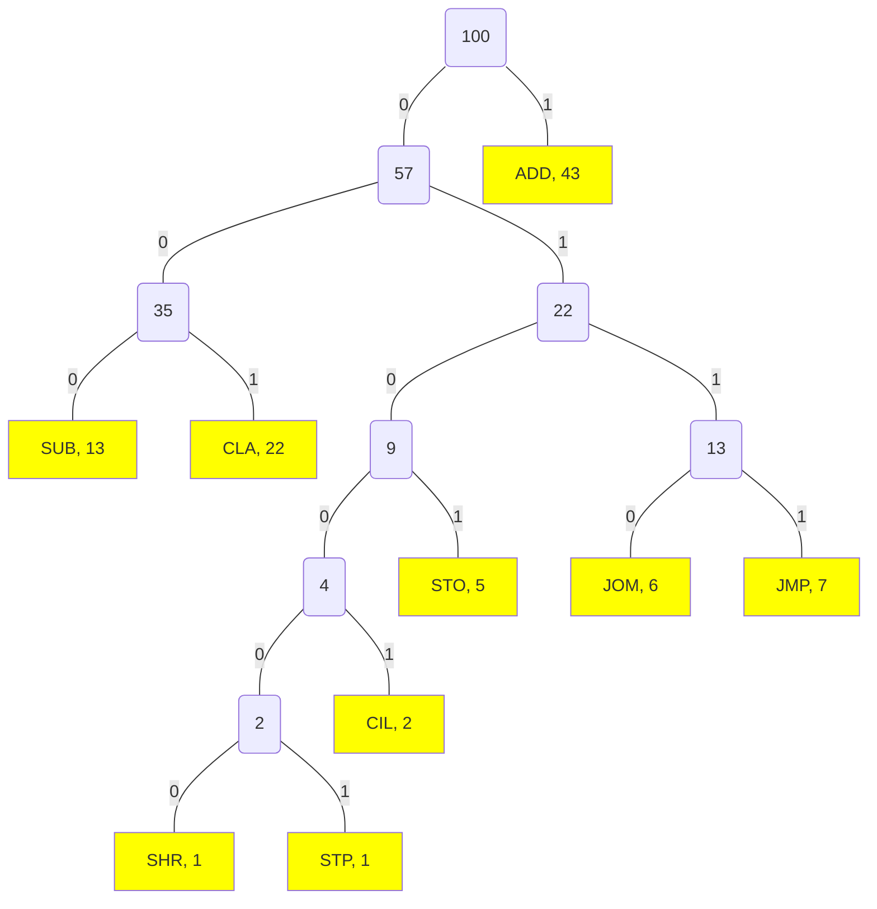

# 第 3 次作业

## 第 1 题（教材 2.11）

> 某台处理机的各条指令使用频度如下表所示。
> 
> | 指令 | 使用频度/% | 指令 | 使用频度/% | 指令 | 使用频度/% |
> | :-: | :--------:| :-: | :--------:| :-: | :--------:|
> | `ADD` | $43$ | `JOM` | $6$ | `CIL` | $2$ |
> | `SUB` | $13$ | `STO` | $5$ | `CLA` | $22$ |
> | `JMP` | $7$ | `SHR` | $1$ | `STP` | $1$ |
> 
> 请分别设计这 $9$ 条指令操作码的哈夫曼编码、3/3/3 扩展编码和 2/7 扩展编码，并计算这三种编码的平均码长。

画出这 $9$ 条指令的（一种可能的）哈夫曼树如下：

因此，这 $9$ 条指令操作码的哈夫曼编码、3/3/3 扩展编码和 2/7 扩展编码如下表所示：

| 指令 | 哈夫曼编码 | 3/3/3 扩展编码 | 2/7 扩展编码 |
| :-: | :--------:| :--------:| :--------:|
| `ADD` | `1` | `00` | `00` |
| `CLA` | `001` | `01` | `01` |
| `SUB` | `000` | `10` | `1000` |
| `JMP` | `0111` | `1100` | `1001` |
| `JOM` | `0110` | `1101` | `1010` |
| `STO` | `0101` | `1110` | `1011` |
| `CIL` | `01001` | `111100` | `1100` |
| `SHR` | `010000` | `111101` | `1101` |
| `STP` | `010001` | `111110` | `1110` |

哈夫曼编码的平均码长为

$$
43\% \times 1 + 22\% \times 3 + 13\% \times 3 + 7\% \times 4 + 6\% \times 4 + 5\% \times 4 + 2\% \times 5 + 1\% \times 6 + 1\% \times 6 = 2.42
$$

3/3/3 扩展编码的平均码长为

$$
43\% \times 2 + 22\% \times 2 + 13\% \times 2 + 7\% \times 4 + 6\% \times 4 + 5\% \times 4 + 2\% \times 6 + 1\% \times 6 + 1\% \times 6 = 2.52
$$

2/7 扩展编码的平均码长为

$$
43\% \times 2 + 22\% \times 2 + 13\% \times 4 + 7\% \times 4 + 6\% \times 4 + 5\% \times 4 + 2\% \times 4 + 1\% \times 4 + 1\% \times 4 = 2.7
$$

## 第 2 题（教材 2.12）

> 某机器的指令字长为 $16$ 位，设有单地址指令和双地址指令两类指令，若每个地址字段均为 $6$ 位，且双地址指令有 $A$ 条，问单地址指令最多可以有多少条？

| 指令种类 | 第 $0\sim 3$ 位 | 第 $4\sim 9$ 位 | 第 $10\sim 15$ 位 |
| :-: | :-: | :-: | :-: |
| 双地址指令 | 操作码 | 地址字段一 | 地址字段二 |
| 单地址指令 | 操作码（前缀） | 扩展操作码 | 地址字段 |

- 双地址指令有两个地址字段，各占 $6$ 位，共占 $12$ 位，剩下的 $4$ 位是双地址指令的操作码。
- 单地址指令有一个地址字段，占 $6$ 位，剩下的 $10$ 位是单地址指令的操作码。为了与双地址指令区分，**单地址指令的操作码前 $4$ 位必须未被双地址指令使用**。

因此，仅有 $(16 - A)$ 个 $4$ 位前缀可用于单地址指令，而每个未被使用的 $4$ 位前缀后跟 $6$ 位扩展操作码，每个前缀可表示 $2^6$ 种单地址指令。

所以，单地址指令的最大数量为

$$
(16 - A) \times 2^6 = 1024 - 16A
$$

## 第 3 题（教材 2.13）

> 某处理机的指令系统要求有三地址指令 $4$ 条、单地址指令 $255$ 条、零地址指令 $16$ 条。设指令字长为 $12$ 位，每个地址码长度为 $3$ 位。问能否用扩展编码为其操作码编码？如果要求单地址指令为 $254$ 条，能否对其操作码扩展编码？说明理由。

### 解答

- 三地址指令包含 $3$ 个地址码，共占 $9$ 位，剩余 $3$ 位用于操作码。$3$ 位操作码最多支持 $8$ 种指令，满足 $4$ 条需求后剩余 $4$ 种操作码（如 $100$、$101$、$110$、$111$）用于扩展。
- 单地址指令包含 $1$ 个地址码，占 $3$ 位，剩余 $9$ 位用于操作码。通过扩展三地址指令未使用的 $4$ 种操作码前缀（每个前缀占 $3$ 位），后续 $6$ 位可编码 $64$ 种指令。因此，单地址指令最大数量为 $4 \times 64 = 256$。
  - 若需 $255$ 条，则剩余 $1$ 个未使用的操作码组合（如 $111\;111111$）。
  - 若需 $254$ 条，则剩余 $2$ 个未使用的操作码组合（如 $111\;111110$、$111\;111111$）。
- 零地址指令无地址码，操作码占满 $12$ 位。需利用单地址指令未使用的操作码组合作为前缀，对于每个未使用的前缀而言，后续 $3$ 位可编码 $2^3 = 8$ 种指令。

因此：

- 若单地址指令需 $255$ 条，则剩余 $1$ 个操作码组合，零地址指令最多生成 $1 \times 8 = 8$ 条，不满足需求。
- 若单地址指令需 $254$ 条，则剩余 $2$ 个操作码组合，零地址指令可生成 $2 \times 8 = 16$ 条，满足需求。
