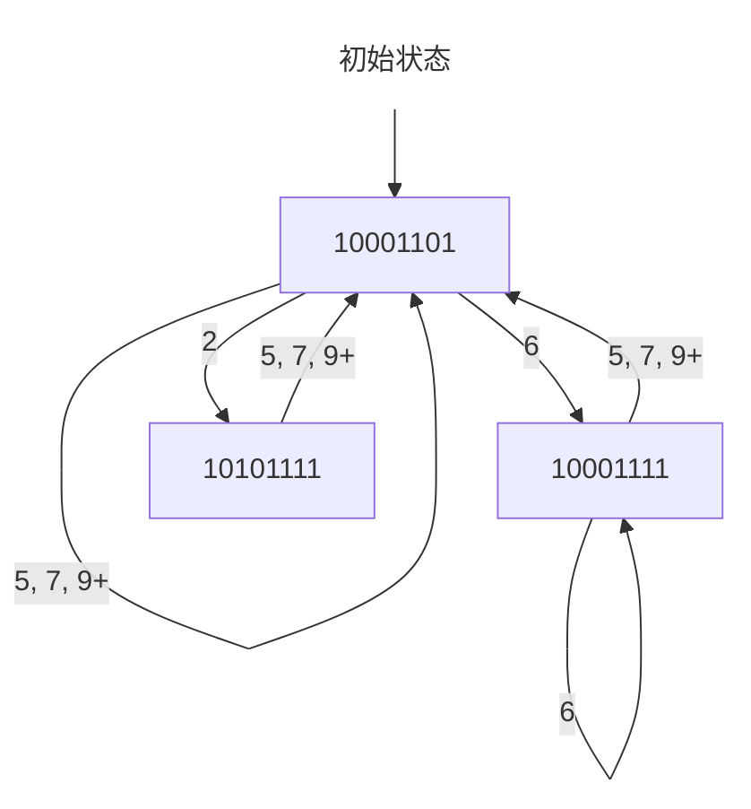
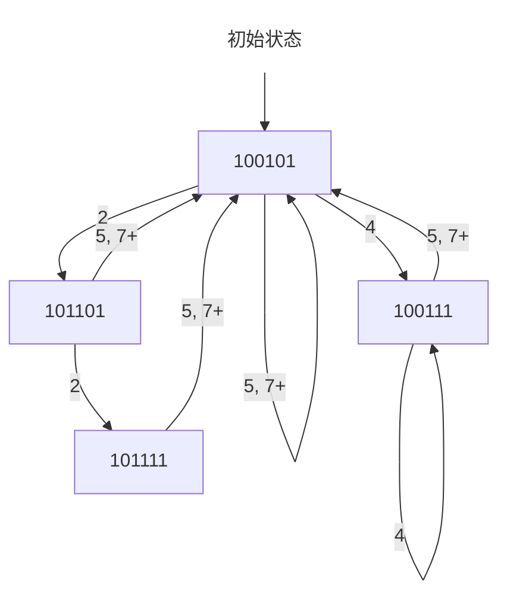

# 第 4 次作业

## 第 1 题（教材 3.9）

> 在一个 $5$ 段流水线处理机上，各段执行时间均为 $\Delta t$，需要经 $9\Delta t$ 才能完成一个任务，其预约表如下表所示。
>
> |功能段 \ 时间 | $1$ | $2$ | $3$ | $4$ | $5$ | $6$ | $7$ | $8$ | $9$ |
> |:-:|:-:|:-:|:-:|:-:|:-:|:-:|:-:|:-:|:-:|
> | $S_1$ | $\checkmark$  |   |   |   |   |   |   |   | $\checkmark$  |
> | $S_2$ |   | $\checkmark$  | $\checkmark$  |   |   |   |   |   |   |
> | $S_3$ |   |   |   | $\checkmark$  |   |   | $\checkmark$  | $\checkmark$  |   |
> | $S_4$ |   |   |   | $\checkmark$  | $\checkmark$  |   |   |   |   |
> | $S_5$ |   |   |   |   |   | $\checkmark$  | $\checkmark$  |   |   |
>
> (1) 画出流水线任务调度的状态转移图。
>
> (2) 求流水线的最优调度策略和流水线的最大吞吐率。
>
> (3) 按最优调度策略连续输入 $6$ 个任务，流水线的实际吞吐率是多少？

(1) 首先求出禁止表 $F$。

- 第一行的差值只有一个 $8$。
- 第二行的差值只有一个 $1$。
- 第三行的差值有三个：$1, 3, 4$。
- 第四行的差值只有一个 $1$。
- 第五行的差值只有一个 $1$。

因此 $F = \{1, 3, 4, 8\}$。然后，由禁止表 $F$ 可以得到初始冲突向量 $C_0 = (10001101)$。最后，可以得到状态转移图如下：

(2) 各种调度策略及其平均间隔时间如下表所示：

| 调度策略 | 平均间隔时间 | 调度策略 | 平均间隔时间 |
| :-: | :-: | :-: | :-: |
| $(2, 5)$ | $3.5\Delta t$ | $(6)$ | $6\Delta t$ |
| $(2, 7)$ | $4.5\Delta t$ | $(6, 7)$ | $6.5\Delta t$ |
| $(5)$ | $5\Delta t$ | $(7)$ | $7\Delta t$ |
| $(5, 6)$ | $5.5\Delta t$ | | |

由上表可知，最佳调度策略是反复循环使用启动距离 $2$ 和 $5$，吞吐率为

$$
\text{TP} = \frac{1}{3.5\Delta t} = \frac{2}{7\Delta t}
$$

(3) 连续输入 $6$ 个任务，实际所用时间为

$$
T_k = 9\Delta t + (2 + 5 + 2 + 5 + 2)\Delta t = 25\Delta t
$$

实际吞吐率为

$$
\text{TP} = \frac{n}{T_k} = \frac{6}{25\Delta t}
$$

## 第 2 题（教材 3.10）

> 有一个 $5$ 段流水线，各段执行时间均为 $\Delta t$，其预约表如下表所示。
>
> |功能段 \ 时间 | $1$ | $2$ | $3$ | $4$ | $5$ | $6$ | $7$ |
> |:-:|:-:|:-:|:-:|:-:|:-:|:-:|:-:|
> | $S_1$ | $\checkmark$  |   |   |   |   |   | $\checkmark$  |
> | $S_2$ |   | $\checkmark$  |   |   | $\checkmark$  |   |   |
> | $S_3$ |   |   | $\checkmark$  | $\checkmark$  |   |   |   |
> | $S_4$ |   |   |   | $\checkmark$  |   |   | $\checkmark$  |
> | $S_5$ |   |   |   |   | $\checkmark$  | $\checkmark$  |   |
>
> (1) 画出流水线任务调度的状态转移图。
>
> (2) 分别求出允许不等时间间隔调度和等时间间隔调度的两种最优调度策略，计算两种调度策略的流水线最大吞吐率。
>
> (3) 若连续输入 $10$ 个任务，分别求采用这两种调度策略的流水线的实际吞吐率和加速比。

(1) 首先求出禁止表 $F$。

- 第一行的差值只有一个 $6$。
- 第二行的差值只有一个 $3$。
- 第三行的差值只有一个 $1$。
- 第四行的差值只有一个 $3$。
- 第五行的差值只有一个 $1$。

因此 $F = \{1, 3, 6\}$。然后，由禁止表 $F$ 可以得到初始冲突向量 $C_0 = (100101)$。最后，可以得到状态转移图如下：

(2) 各种调度策略及其平均间隔时间如下表所示：

| 调度策略 | 平均间隔时间 | 调度策略 | 平均间隔时间 |
| :-: | :-: | :-: | :-: |
| $(2, 2, 5)$ | $3\Delta t$ | $(4, 5)$ | $4.5\Delta t$ |
| $(2, 5)$ | $3.5\Delta t$ | $(5)$ | $5\Delta t$ |
| $(4)$ | $4\Delta t$ | | |

由上表可知：

- 若允许不等时间间隔调度，则最佳调度策略是反复循环使用启动距离 $2$、$2$ 和 $5$。此时最大吞吐率为
    $$
    \text{TP} = \frac{1}{3\Delta t}
    $$
- 若只允许等时间间隔调度，则最佳调度策略是使用启动距离 $4$。此时最大吞吐率为
    $$
    \text{TP} = \frac{1}{4\Delta t}
    $$

(3) 连续输入 $10$ 个任务：

- 若允许不等时间间隔调度，则实际所用时间为
    $$
    T_k = 7\Delta t + (2 + 2 + 5 + 2 + 2 + 5 + 2 + 2 + 5)\Delta t = 34\Delta t
    $$
    实际吞吐率为
    $$
    \text{TP} = \frac{n}{T_k} = \frac{10}{34\Delta t} = \frac{5}{17\Delta t}
    $$
    加速比为
    $$
    S = \frac{T_s}{T_k} = \frac{10 \times 7\Delta t}{34\Delta t} = 2.059
    $$
- 若只允许等时间间隔调度，则实际所用时间为
    $$
    T_k = 7\Delta t + 9 \times 4\Delta t = 43\Delta t
    $$
    实际吞吐率为
    $$
    \text{TP} = \frac{n}{T_k} = \frac{10}{43\Delta t}
    $$
    加速比为
    $$
    S = \frac{T_s}{T_k} = \frac{10 \times 7\Delta t}{43\Delta t} = 1.628
    $$

## 第 3 题（教材 3.12）

> 假设各种分支指令数占所有指令数的百分比如下表所示。
>
> | 分支种类 | 占比 |
> | :-: | :-: |
> | 条件分支 | $20\%$（其中的 $60\%$ 是分支成功的） |
> | 跳转和调用 | $5\%$ |
>
> 现有一条段数为 $4$ 的流水线，无条件分支在第二个时钟周期结束时就被解析出来，而条件分支要到第三个时钟周期结束时才能够被解析出来。第一个流水段是完全独立于指令类型的，即所有类型的指令都必须经过第一个流水段的处理。请问在没有任何控制相关的情况下，该流水线相对于存在上述控制相关情况下的加速比是多少?

在没有任何控制相关的情况下，流水线的平均 CPI 为 $\text{CPI}_0 = 1$。

在存在上述控制相关的情况下：

- 若采用排空流水线的方法：
  - 对于无条件分支，需要额外等待 $1$ 个周期；
  - 对于条件分支，需要额外等待 $2$ 个周期。

  因此，平均 CPI 为
  $$
  \text{CPI}_1 =  1 + 20\% \times 2 + 5\% \times 1 = 1.45
  $$
  加速比为
  $$
  S = \frac{\text{CPI}_1}{\text{CPI}_0} = 1.45
  $$
- 若采用预测分支失败的方法：
    - 对于无条件分支，需要额外等待 $1$ 个周期；
    - 对于分支成功的条件分支，需要额外等待 $2$ 个周期；
    - 对于分支失败的条件分支，不需要额外等待周期。

    因此，平均 CPI 为
    $$
    \text{CPI}_2 = 1 + 20\% \times (60\% \times 2 + 40\% \times 0) + 5\% \times 1 = 1.29
    $$
    加速比为
    $$
    S = \frac{\text{CPI}_2}{\text{CPI}_1} = 1.29
    $$

- 若采用预测分支成功的方法：
    - 对于无条件分支，需要额外等待 $1$ 个周期；
    - 对于分支成功的条件分支，需要额外等待 $1$ 个周期；
    - 对于分支失败的条件分支，需要额外等待 $2$ 个周期。

    因此，平均 CPI 为
    $$
    \text{CPI}_3 = 1 + 20\% \times (60\% \times 1 + 40\% \times 2) + 5\% \times 1 = 1.33
    $$
    加速比为
    $$
    S = \frac{\text{CPI}_3}{\text{CPI}_0} = 1.33
    $$
