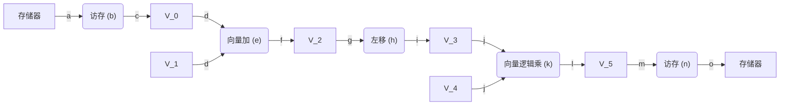
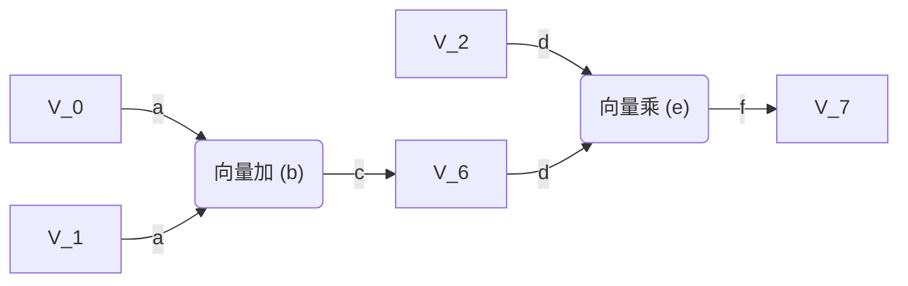

# 第 5 次作业

## 第 1 题（教材 4.6）

> 在 Cray-1 上，按照链接方式执行下述 $5$ 条向量指令（括号中给出了相应功能部件的时间），如果向量寄存器和功能部件之间数据传输需要一拍，试求此链接流水线的通过时间是多少拍？如果向量长度为 $64$，则需要多少拍才能得到全部结果？
>
> ```cpp
> V_0 = 存储器        // 从存储器中取数：7 拍
> V_2 = V_0 + V_1    // 向量加：3 拍
> V_3 = V_2 << A_3   // 左移 A_3 位：5 拍
> V_5 = V_3 & V_4    // 向量逻辑乘：2 拍
> 存储器 = V_5        // 向存储器中存数：7 拍
> ```

链接示意图如下图所示：



该链接流水线的通过时间（单位：拍）为

$$
\begin{align*}
& \quad a + b + c + d + e + f + g + h + i + j + k + l + m + n + o \\
& = 1 + 7 + 1 + 1 + 3 + 1 + 1 + 5 + 1 + 1 + 2 + 1 + 1 + 7 + 1 \\
& = 34
\end{align*}
$$

如果向量长度为 $64$，则得到全部结果所需时间（单位：拍）为：

$$
34 + (64 - 1) = 97
$$

## 第 2 题（教材 4.7）

> 某向量处理机有 $16$ 个向量寄存器，其中 $V_0$~$V_5$ 中分别放有向量 $\boldsymbol{A}$、$\boldsymbol{B}$、$\boldsymbol{C}$、$\boldsymbol{D}$、$\boldsymbol{E}$、$\boldsymbol{F}$，向量长度均为 $8$，向量各元素均为浮点数；处理部件采用两条单功能流水线，加法功能部件时间为 $2$ 拍，乘法功能部件时间为 $3$ 拍。采用类似 Cary-1 的链接技术，先计算 $(\boldsymbol{A} + \boldsymbol{B}) \times \boldsymbol{C}$，在流水线不停流的情况下，接着计算 $(\boldsymbol{D} + \boldsymbol{E}) \times \boldsymbol{F}$。
>
> (1) 求此链接流水线的通过时间（设寄存器入、出各需一拍）。
>
> (2) 假如每拍时间为 $50\;\mathrm{ns}$，完成这些计算并把结果存入相应寄存器，此处理部件的实际吞吐率为多少 $\mathrm{MFLOPS}$？

(1) 因为计算 $(D + E) \times F$ 紧接在 $(A + B) \times C$ 之后，因此该链接流水线的通过时间即为 $(A + B) \times C$ 的通过时间。

链接示意图如下图所示：



该链接流水线的通过时间（单位：拍）为

$$
\begin{align*}
& \quad a + b + c + d + e + f \\
& = 1 + 2 + 1 + 1 + 3 + 1 \\
& = 9
\end{align*}
$$

(2) 完成时间为

$$
T_k = (9 + (8 - 1) + 8) \times 50\;\mathrm{ns} = 1.2\;\mathrm{\mu s}
$$

实际吞吐率为

$$
\text{TP} = \frac{n \times \text{MVL}}{T_k} = \frac{4 \times 8}{1.2\;\mathrm{\mu s}} = 26.67\;\mathrm{MFLOPS}
$$

## 第 3 题（教材 4.8）

> 在一台向量处理机上实现 $\boldsymbol{A} = \boldsymbol{B} \times S$ 计算，其中 $\boldsymbol{A}$ 和 $\boldsymbol{B}$ 是长度为 $N = 200$ 的向量，$S$ 是一个标量。向量寄存器长度 $\text{MVL} = 64$，各功能部件的启动时间为：取数和存数部件为 $12$ 个时钟周期、乘法部件为 $7$ 个时钟周期，执行标量代码的开销 $T_{\text{loop}} = 15$ 个时钟周期，对一个向量元素执行一次操作的时间 $T_g = 1$ 个时钟周期。求 $\boldsymbol{A}$ 的总执行时间。

由于 $N > \text{MVL}$，故需要使用分段开采方法。每次循环主要有下面三条向量指令组成：

```cpp
V_1 = B         // 从存储器中取数：12 拍
V_2 = V_1 * S   // 向量与标量的乘法：7 拍
A = V_2         // 向存储器中存数：12 拍
```

三条指令之间存在有写读数据相关，因此，在不使用链接技术的情况下，需要把它们分成 $m = 3$ 个编队。

该流水线的启动时间（单位：拍）为

$$
T_{\text{start}} = 12 + 7 + 12 = 31
$$

因此，总的执行时间（单位：拍）为

$$
\begin{align*}
T_{\text{all}} & = \left\lceil\frac{N}{\text{MVL}}\right\rceil \cdot(T_{\text{start}} + T_{\text{loop}}) + mN \\
& = \left\lceil\frac{200}{64}\right\rceil \times (31 + 15) + 3 \times 200 \\
& = 784
\end{align*}
$$

## 第 4 题（教材 4.9）

> 向量处理机 Cray Y-MP/8 的机器周期时间为 $6\;\mathrm{ns}$，一个周期可以完成一次加法和一次乘法运算。另外，$8$ 台处理机在最好的情况下可以同时运算而互不干扰。计算 Cray Y-MP/8 的峰值性能。

因为 Cray Y-MP/8 在一个时钟周期可以完成两次浮点运算，因此峰值性能为

$$
\begin{align*}
R_{\infty} & = 8 \times \frac{2 \times (6\;\mathrm{ns})^{-1}}{1} \\
& = 2.67\;\mathrm{GFLOPS}
\end{align*}
$$
