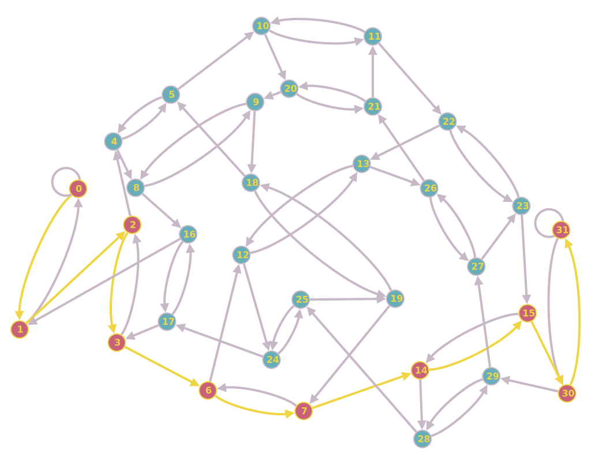
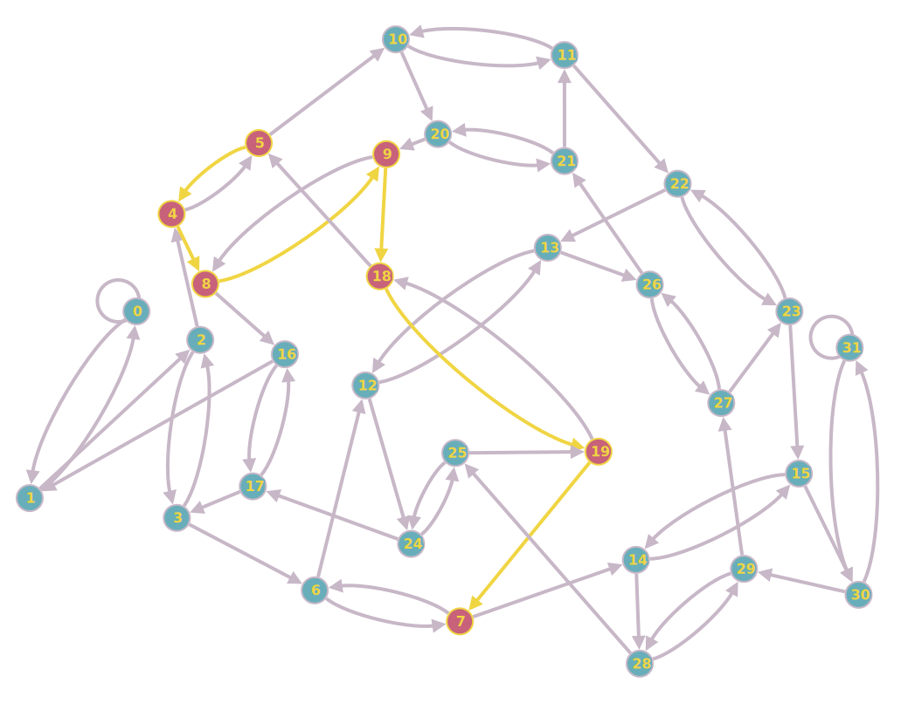
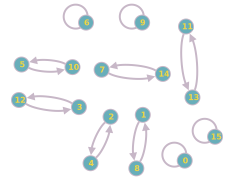

# 第 8 次作业

## 第 1 题（教材 9.9）

> 设函数的自变量是十进制数表示的处理机编号。现有 $32$ 台处理机，其编号为 $0, 1, 2, \cdots, 31$。
>
> (1) 分别计算下列互连函数。
>
> $$
> \text{Cube}_2(12) \quad \sigma(8) \quad \beta(9) \quad \text{PM2I}_{+3}(28) \quad \text{Cube}_0(\sigma(4)) \quad \sigma(\text{Cube}_0(18))
> $$
>
> (2) 用 $\text{Cube}_0$ 和 $\sigma$ 构成混洗交换网（每步只能使用 $\text{Cube}_0$ 和 $\sigma$ 一次），网络直径是多少？从 $5$ 号处理机发送数据到 $7$ 号处理机，最短路径要经过几步？请列出经过的处理机编号。
>
> (3) 采用移数网络构成互联网，网络直径是多少？结点度是多少？与 $2$ 号处理机距离最远的是几号处理机？

(1) 计算如下：

$$
\begin{align*}
\text{Cube}_2(12) & = \text{Cube}_2(01100) = 01000 = 8 \\
\sigma(8) & = \sigma(01000) = 10000 = 16 \\
\beta(9) & = \beta(01001) = 11000 = 24 \\
\text{PM2I}_{+3}(28) & = (28 + 2^3) \bmod 32 = 4 \\
\text{Cube}_0(\sigma(4)) & = \text{Cube}_0(\sigma(00100)) = \text{Cube}_0(01000) = 01001 = 9 \\
\sigma(\text{Cube}_0(18)) & = \sigma(\text{Cube}_0(10010)) = \sigma(10011) = 00111 = 7
\end{align*}
$$

(2) 构成的混洗交换网如下图所示：

<!-- 我使用的是 https://graphonline.top/ 这个网站 -->

由图知网络直径为 $9$。

从 $5$ 号处理机发送数据到 $7$ 号处理机，最短路径要经过 $6$ 步：

$$
5 \to 4 \to 8 \to 9 \to 18 \to 19 \to 7
$$

(3) 如果使用循环移数网络，则在 $N = 2^n = 32$ 的条件下：

- 直径为 $D = \lceil n / 2\rceil = 3$。
- 结点度为 $d = 2n - 1 = 9$。

考虑 $0$ 号处理机，它的“对面”是 $16$ 号处理机，$0$ 号处理机距离 $11, 13, 19, 21$ 号处理机最远，距离为直径，为 $3$。

因此，与 $2$ 号处理机距离最远的是 $13, 15, 21, 23$ 号处理机。

## 第 2 题（教材 9.10）

> $N = 16$ 的互连网络的输入端号和输出端号分别为 $0\sim 15$。若互连网络实现的互连可以用互连函数表示为 $f(x_3x_2x_1x_0) = x_0x_1x_2x_3$，那么，是否可以用循环表示法表示该互连网络实现的互连？如果可以，请写出其循环表示。

画出网络如下图所示：

由图知循环表示为

$$
(1\quad 8)(2 \quad 4)(3 \quad 12)(5 \quad 10)(7 \quad 14)(11 \quad 13)
$$

## 第 3 题（教材 9.11）

> $N = 16$ 的 STARAN 网络在级控制方式下实现分组交换置换，如果实现的分组交换置换是：首先是 $4$ 组 $4$ 元交换，然后是 $2$ 组 $8$ 元交换，最后是 $1$ 组 $16$ 元交换，写出网络实现的互连函数。

不妨设最初的输入为 $(0, 1, 2, 3, 4, 5, 6, 7, 8, 9, A, B, C, D, E, F)$。

经过 $4$ 组 $4$ 元交换后，序列为 $(3, 2, 1, 0, 7, 6, 5, 4, B, A, 9, 8, F, E, D, C)$。

经过 $2$ 组 $8$ 元交换后，序列为 $(4, 5, 6, 7, 0, 1, 2, 3, C, D, E, F, 8, 9, A, B)$。

经过 $1$ 组 $16$ 元交换后，序列为 $(B, A, 9, 8, F, E, D, C, 3, 2, 1, 0, 7, 6, 5, 4)$。

用循环表示互连函数为

$$
(0 \quad B)(1 \quad A)(2 \quad 9)(3 \quad 8)(4 \quad F)(5 \quad E)(6 \quad D)(7 \quad C)
$$

即

$$
f(x_3x_2x_1x_0) = \bar{x}_3x_2\bar{x}_1\bar{x}_0
$$

## 第 4 题（教材 9.12）

> 具有 $N = 2^n$ 个输入端的 Omega 网络，采用单元控制。
>
> (1) $N$ 个输入总共应有多少种不同的排列？
>
> (2) 该 Omega 网络通过一次可以实现的置换总共可有多少种？
>
> (3) 若 $N = 8$，计算一次通过能实现的置换数占全部排列的百分比。

(1) $N$ 个输入总应有 $N!$ 中不同 的排列。

(2) $N = 2^n$ 个输入端的 Omega 网络有 $\log_2 N$ 级，每级都有 $N/2$ 个 $2\times 2$ 开关。由于实现的是置换，因此开关只有“直送”或“交换”两种可用状态。每种不同的开关配置都将形成一种不同的排列。因此，该 Omega 网络通过一次可以实现的置换的总数为

$$
2^{(\log_2 N) \times N/2} = N^{N/2}
$$

(3) 当 $N = 8$ 时，计算一次通过能实现的置换数占全部排列的百分比为

$$
\frac{N^{N/2}}{N!} = \frac{8^4}{8!} \approx 10.159\%
$$
